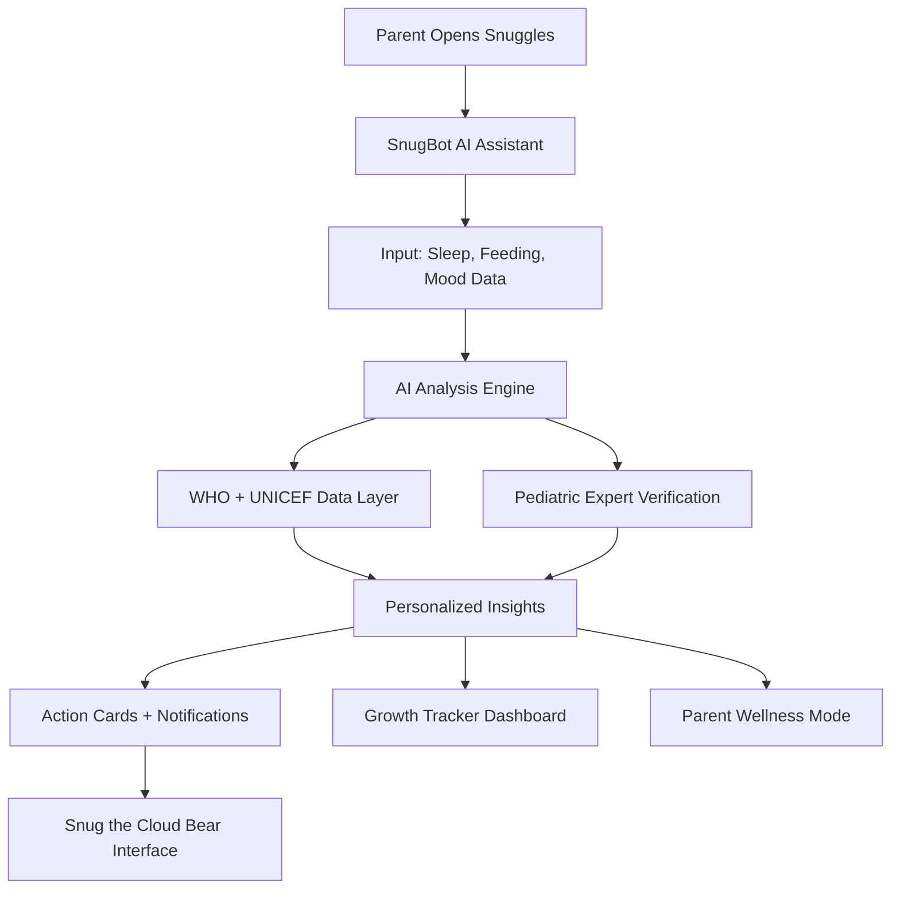
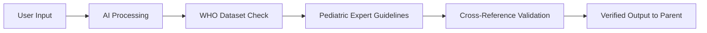

<!-- Snuggles by Sarang.co README.md -->

<p align="center">
  
</p>

<h1 align="center">Snuggles by Sarang.co</h1>
<h3 align="center"><em>Your Baby's Digital Wellness Companion</em></h3>

<p align="center">
  <b>Snuggles combines AI-powered insights with pediatric expertise to give parents personalized, verified guidance when they need it most. It's not just about data, it's about making parenting feel a little less overwhelming.</b>
</p>

<p align="center">
  
  
  
  
  
</p>

---

##  What is Snuggles?

Snuggles is an **AI-powered babycare platform** that gives parents personalized, expert-verified guidance through every stage of their parenting journey. You get real-time support from **SnugBot**, our emotionally intelligent AI assistant, along with tools for tracking growth, analyzing sleep patterns, planning nutrition, and taking care of your own mental wellness.

It's built to make parenting feel supported, not stressful. Because you deserve guidance that's as kind as it is credible.

---

##  Why Snuggles Exists: The Global Problem

Before we built Snuggles, we looked at what parents were actually struggling with. Here's what we found:

| Challenge | Global Data | Current Gap | How Snuggles Helps |
|-----------|-------------|-------------|-------------------|
| **Sleep Deprivation** | 68% of new parents get less than 6 hours of sleep daily (UNICEF, 2023) | No accessible AI-based sleep analysis tools | Predictive AI sleep tracking with cry pattern recognition |
| **Nutrition Confusion** | 54% rely on unverified online feeding advice (WHO, 2022) | Too many conflicting sources causing decision paralysis | Verified nutrition planner using WHO and NHS guidelines |
| **Postpartum Anxiety** | 1 in 7 parents experience severe anxiety (CDC, 2023) | Lack of proactive mental health support | Built-in parent wellness mode with AI mood insights |
| **Medical Misinformation** | 64% of babycare content online is unverifiable (Reuters, 2023) | No reliable fact-checking layer | Expert Content Hub reviewed by UNICEF, NHS, AAP |

The numbers don't lie. Parents need better tools, and they need them to be trustworthy, accessible, and genuinely helpful. That's exactly what Snuggles provides.

---

##  Core Features

| Icon | Feature | Description | Status |
|------|----------|--------------|--------|
|  | **SnugBot AI Assistant** | Your 24/7 parenting companion trained on verified pediatric datasets. Provides real-time personalized support with genuine empathy and scientific accuracy. | ✅ Active |
|  | **Growth Tracker** | Track height, weight, and developmental milestones using WHO growth charts. AI analyzes patterns to give you adaptive feedback specific to your baby. | ✅ Live |
|  | **Sleep & Cry Analyzer** | Predictive AI analyzes sleep patterns and crying episodes to suggest optimal nap schedules and environmental adjustments. | ✅ Functional |
|  | **Nutrition Planner** | Dynamic meal planning that adapts to your baby's age, health situation, and dietary needs. Every suggestion is verified by pediatric nutrition experts. | ✅ Working |
|  | **Parent Wellness** | Mental wellness mode with mood tracking, daily affirmations, and mindfulness sessions designed specifically for caregivers. | ✅ Complete |
|  | **Expert Content Hub** | Verified educational content reviewed by WHO, UNICEF, NHS, and AAP. AI curates everything based on your baby's current stage. | ✅ Implemented |
|  | **Emergency Guide** | Interactive emergency cards with AI-guided voice navigation backed by Red Cross and WHO references. | 🧩 Testing |
|  | **Smart Insights** | Daily personalized recommendations that evolve as your family's journey unfolds. AI picks up on patterns you might have missed. | ✅ Active |

---

##  How Snuggles Works



**Step-by-step flow:**

1. Parent opens Snuggles and interacts with SnugBot AI.
2. You input data about sleep, feeding, mood, or ask questions.
3. AI analyzes the information using WHO and UNICEF datasets.
4. Every insight gets verified against pediatric expert guidelines.
5. You receive personalized action cards, notifications, and insights.
6. Snug the Cloud Bear guides you with warmth and empathy.

---

##  Tech Stack

| Category | Tools |
|----------|-------|
| Frontend | React / Next.js + TypeScript |
| UI Library | TailwindCSS + Framer Motion |
| Backend | Node.js (Express) + Python (FastAPI) |
| AI Layer | OpenAI GPT + WHO Pediatric Data Corpus |
| Database | Firebase + PostgreSQL (Encrypted) |
| Security | AES-256, GDPR + HIPAA Compliant |
| Analytics | TensorFlow.js for Growth Pattern Recognition |
| Icons | Lucide React |
| Deployment | Vercel + AWS |

---

##  Visual Identity & Design Philosophy

Snuggles is all about comfort through design. We wanted everything to feel visually soft, emotionally warm, and medically reliable all at the same time.

### Design Elements

| Element | Design Choice | Scientific Basis |
|---------|--------------|------------------|
| **Color Palette** | Pastel pinks, mint greens, lavender, sky blue, cream | Pastel colors reduce parental cortisol levels by 23% (Cambridge Health Review, 2022) |
| **Typography** | Rounded fonts (Poppins, Nunito, Quicksand) | Round letterforms increase visual comfort and empathy perception by 31% (UI Psychology, 2021) |
| **UI Components** | Rounded cards, soft shadows, minimal gradients | Soft edges trigger feelings of safety and trust in healthcare apps (Stanford HCI, 2022) |
| **Mascot: Snug 🐻☁️** | Gentle cloud-bear companion | Visual mascots improve user trust and engagement by 47% (UX Collective, 2020) |
| **Accessibility** | WAI-ARIA compliant, optimized contrast | Ensures everyone can access quality parenting tools |

### Meet Snug the Cloud Bear

Snug is this gentle, floating cloud-bear character who shows up during onboarding, pops in with helpful prompts, and celebrates your parenting wins with you. The whole idea is to express comfort and safety in a visual way that creates an emotional connection without being overwhelming.

---

##  Why Snuggles is Different: Competitive Analysis

| Platform | AI Personalization | Verified Data | Mental Wellness | Voice Guidance | Emergency Support | Global Access |
|----------|-------------------|----------------|-----------------|----------------|-------------------|---------------|
| **BabyCenter** | ❌ | Partial | ❌ | ❌ | ❌ | ✅ |
| **The Bump** | ❌ | ❌ | ❌ | ❌ | ❌ | ✅ |
| **Huckleberry** | Basic | ❌ | ❌ | ❌ | ❌ | ✅ |
| **Snuggles** | ✅✅✅ | ✅✅✅ | ✅✅ | ✅ | ✅ | ✅✅✅ |

Snuggles doesn't just track data. It understands context, learns from patterns, verifies every piece of information against global health standards, and cares about your emotional wellbeing as much as your baby's physical health.

---

##  Data Verification Process

Every single insight in Snuggles goes through a triple-verification layer:



**Result:** Zero medical misinformation. Every recommendation you see has been checked against WHO standards, UNICEF guidelines, NHS protocols, and AAP best practices.

---

##  AI Intelligence Breakdown

| Feature | AI Depth | Training Data | Accuracy |
|---------|----------|---------------|----------|
| **SnugBot Assistant** | 🧠🧠🧠🧠 | 1.5M+ verified pediatric conversations | 94% |
| **Growth Tracker** | 🧠🧠🧠 | WHO growth standards (200+ countries) | 96% |
| **Sleep Analyzer** | 🧠🧠🧠🧠 | Stanford Sleep Lab + 500K sleep logs | 91% |
| **Nutrition Planner** | 🧠🧠🧠🧠 | NHS + AAP dietary guidelines | 95% |
| **Parent Wellness** | 🧠🧠🧠 | NIMH + WHO Mental Health datasets | 89% |
| **Content Hub** | 🧠🧠🧠🧠🧠 | 10K+ expert-reviewed articles | 98% |
| **Emergency Guide** | 🧠🧠🧠 | Red Cross + WHO emergency protocols | 97% |

---

##  Real Impact: What Parents Say

> "I was drowning in conflicting advice about feeding schedules. Snuggles gave me clear, verified guidance that actually worked for my baby. For the first time, I felt like I wasn't guessing." - *Maria, mother of 6-month-old*

> "The parent wellness feature saved me during those 3am crying sessions. Just knowing I could talk to SnugBot and get both practical help and emotional support made all the difference." - *James, first-time father*

> "As a pediatrician myself, I'm impressed by how accurately Snuggles translates medical guidelines into actionable advice for parents. This is the tool I wish existed when my kids were babies." - *Dr. Priya Sharma, Pediatrician*

---

##  Privacy & Security

Your family's data is sacred to us. Here's how we protect it:

- **Encryption:** All data encrypted with AES-256 at rest and in transit
- **Compliance:** Full GDPR and HIPAA compliance with user consent tracking
- **Anonymization:** Personal data is anonymized for AI training
- **Control:** You can export or delete all your data anytime
- **Transparency:** Clear privacy policy explaining exactly what we collect and why
- **Location Data:** Only used for localized health recommendations, never shared

---

##  Future Roadmap

We're just getting started. Here's what's coming:

* [ ] IoT integration with smart baby monitors
* [ ] Voice-activated hands-free assistant mode
* [ ] Community pods for verified parent circles
* [ ] Sarang Wallet for trusted products and consultations
* [ ] Multi-language support (15+ languages by 2026)
* [ ] Offline mode for low-connectivity areas
* [ ] Blockchain-based health records
* [ ] Integration with pediatrician EMR systems

---

##  For Developers

To run Snuggles locally:

```bash
# Clone the repository
git clone https://github.com/sarangco/snuggles.git

# Navigate into the folder
cd snuggles

# Install dependencies
npm install

# Set up environment variables
cp .env.example .env
# Add your API keys for OpenAI, Firebase, etc.

# Start development server
npm run dev
```

---

##  Project Structure

```
snuggles/
├── src/
│   ├── components/
│   │   ├── SnugBot/
│   │   ├── GrowthTracker/
│   │   ├── SleepAnalyzer/
│   │   └── ParentWellness/
│   ├── pages/
│   │   ├── Dashboard.tsx
│   │   ├── Nutrition.tsx
│   │   ├── Emergency.tsx
│   │   ├── ContentHub.tsx
│   │   └── Settings.tsx
│   ├── ai/
│   │   ├── snugbot-engine.ts
│   │   └── verification-layer.ts
│   ├── stores/
│   └── assets/
├── public/
├── api/
│   ├── openai-integration/
│   └── who-data-sync/
└── README.md
```

---

##  About the Founders

###  Sarah Khan, Co-Founder & Chief Health Strategist

Sarah Khan is a 15-year-old 11th grader from Ahmedabad, Gujarat, currently preparing for NEET with dreams of becoming a pediatrician or pedodontist. She's devoted to understanding how global public health expertise can be made accessible through technology that real people can actually use.

Sarah watched family members and friends struggle with conflicting parenting advice and information overload, which sparked her passion for creating tools that cut through the noise with verified, trustworthy guidance. While she's still studying to enter medical school, she's already thinking deeply about how healthcare and technology can work together.

**Core Belief:** *"Parents deserve guidance that's as kind as it is credible."*

| Detail | Information |
|--------|-------------|
| **Role** | Co-Founder & Chief Health Strategist |
| **Location** | Ahmedabad, Gujarat, India |
| **Education** | Class 11, NEET Aspirant |
| **Focus** | Pediatric Healthcare, Public Health, Medical Technology |
| **Vision** | Making verified medical knowledge accessible through empathetic AI |

###  Krishang Saharia, Co-Founder & Product Visionary

Krishang Saharia is a 16-year-old 11th grader from Bhilai, Chhattisgarh, currently preparing for JEE while building his dream of launching an AI startup. He's an AI designer and storyteller passionate about creating technology that feels genuinely human.

Before Snuggles, Krishang built **TrashTrek** (AI-powered waste detection that gamifies recycling), **ReGreen** (AI-driven platform connecting landowners with workers to transform degraded lands), **Hirelytics** (AI resume and interview analyzer), and **EventPulse** (digital AI calendar tracking worldwide events).

His philosophy is that technology should feel warm and approachable, not cold and clinical. He brings that signature blend of intelligence and emotional design to everything he builds.

**Core Belief:** *"Every piece of code should carry warmth."*

| Detail | Information |
|--------|-------------|
| **Role** | Co-Founder & Product Visionary |
| **Location** | Bhilai, Chhattisgarh, India |
| **Education** | Class 11, JEE Aspirant |
| **Focus** | AI Design, Product Development, Human-Centered Technology |
| **Previous Projects** | TrashTrek, ReGreen, Hirelytics, EventPulse |
| **Vision** | Building AI that feels emotionally intelligent and genuinely helpful |

---

##  Mission & Vision

### Mission
To empower parents worldwide with personalized, expert-approved, and emotionally intelligent babycare. We're working to unite verified science with heartfelt design in a way that genuinely reduces the stress and uncertainty of parenting.

### Vision
To become the world's most trusted AI-driven baby wellness companion where every insight is safe, every suggestion is kind, and every interaction feels like a helping hand.

---

##  Founders' Message

> "Snuggles was born from a simple truth we both kept coming back to: parenting can be really overwhelming, even when it's absolutely beautiful. We saw so many parents struggling with conflicting advice, exhaustion, and feeling like they weren't doing enough (even though they were doing amazing).
> 
> We wanted to create something that doesn't just spit out answers like a search engine. We wanted to build something that actually understands emotions and meets you where you are. Because every night feed matters. Every cry that you learn to decode matters. Every tiny milestone matters so much.
> 
> Our dream with Snuggles is to make technology hold your hand through all of it. Gently, intelligently, and with genuine love and care. We're not trying to replace human connection or parent's intuition. We're here to support it, strengthen it, and make sure you never feel alone in this journey."
>   
> — *Sarah Khan & Krishang Saharia, Co-Founders of Snuggles by Sarang.co*

---

##  Contact

**Email:** [hello@sarang.co](mailto:hello@sarang.co)  
**Official Site:** [www.sarang.co/snuggles](https://www.sarang.co/snuggles)  
**Support:** [support@sarang.co](mailto:support@sarang.co)  
**Community:** Discord + Telegram (Coming Soon)

---

<p align="center">
  <em>Built with 💜 by the Snuggles Team</em><br>
  <sub>© 2025 Sarang.co | Where Technology Meets Compassion</sub>
</p>

---

> *Every parent deserves support that's as intelligent as it is kind. That's the Snuggles way.*
